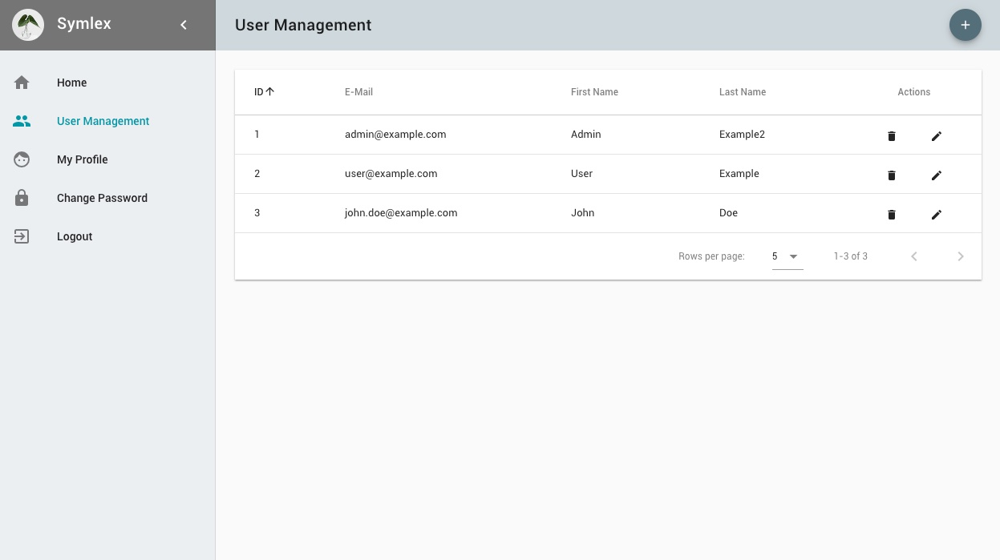

# Symlex: A lean framework stack for agile Web development based on Symfony and Vuetify

Symlex aims to simplify agile Web development by providing a working system that promotes best practices by example.
Since its initial release in 2014, it has proven to be well suited for rapidly building microservices, 
CLI and single-page applications. It comes complete with working examples from testing to forms and database 
abstraction. Simply delete what you don't need.

The [kernel](https://github.com/symlex/di-microkernel) is extremely lean and only creates a 
service container for bootstrapping your application within its context.
Using a single container for configuration and dependency injection reduces complexity and leads to improved 
performance compared to other frameworks.
It also prevents developers from thoughtlessly installing bundles without understanding
them. The result is less bloat and simpler, more maintainable and testable code that is fundamental for agile development.
            
Plain classes are used wherever possible to avoid vendor lock-in and enable framework independent code reuse.

You can combine the PHP based backend with any JavaScript library or REST client. 
A working example for command line applications is included as well.

## Key Features ##

- Built on top of well documented and tested standard components
- Contains everything to create full-featured Web applications: Service container, REST routing & Twig template engine
- Strict use of dependency injection for configuration and bootstrapping
- Small code and memory footprint
- Extremely fast compared to other PHP frameworks

## User Interface ##

The front-end boilerplate is there for your convenience and puts you straight on track for 
building impressive single-page applications with [Webpack](https://webpack.js.org/), [Vue.js](https://vuejs.org/) and [Vuetify](https://vuetifyjs.com/en/). 

